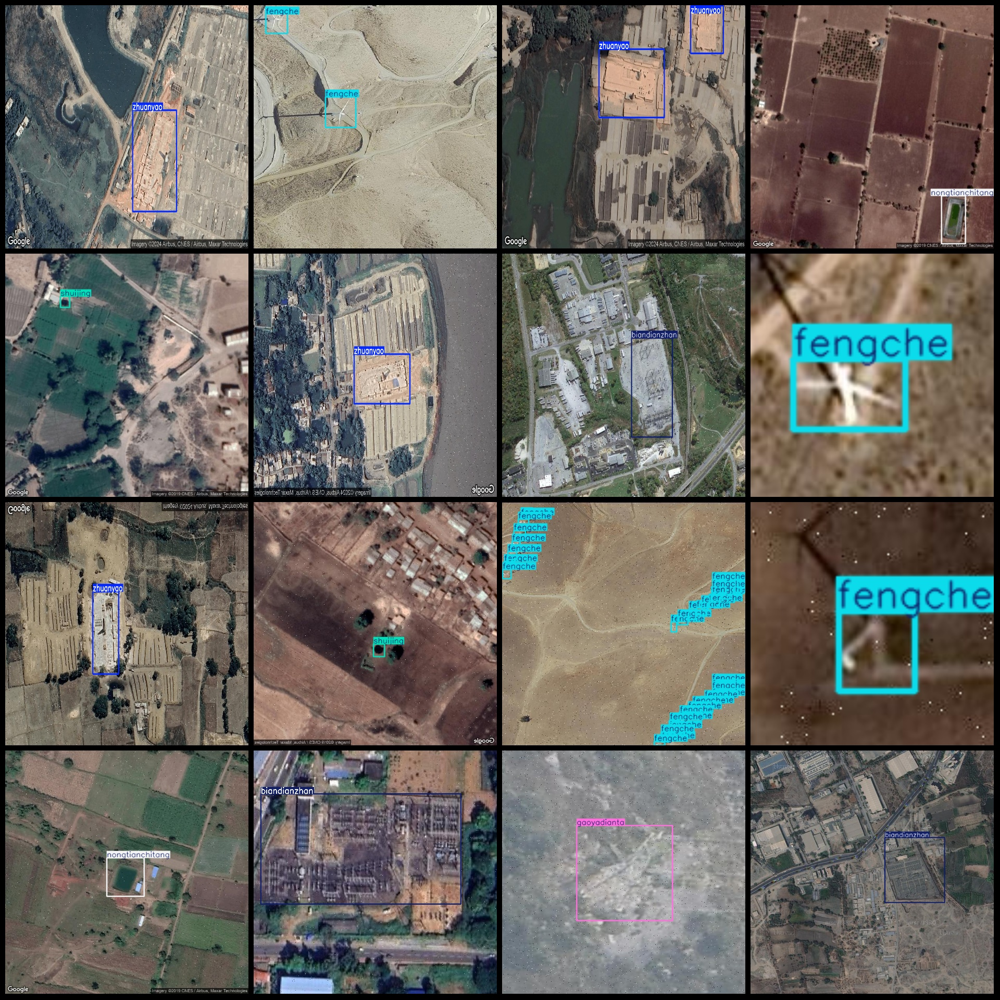
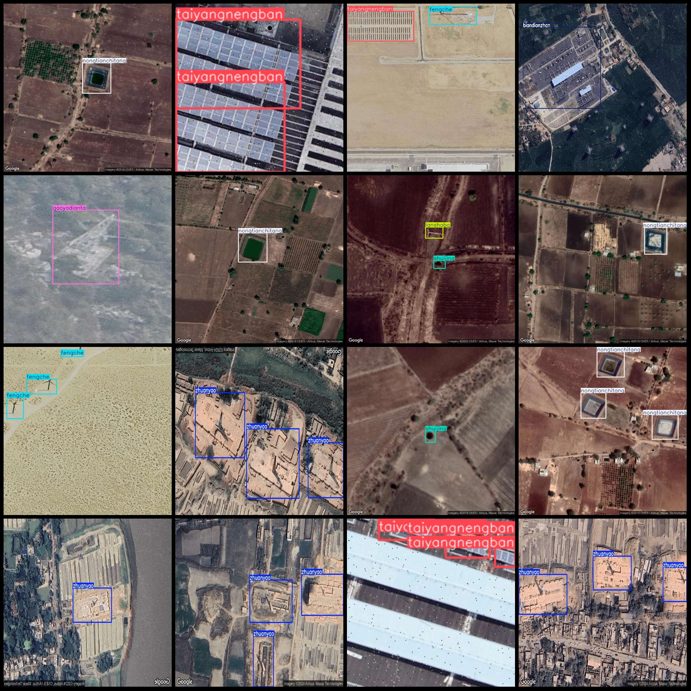

# Remote Sensing Image Energy and Water Conservancy Facilities Detection Dataset VOC+YOLO Format 2250 Images 8 Categories

Pascal VOC format+YOLO format: A dataset format that includes images, XML files, and txt files. It does not include any split paths. The txt file contains the VOC format and the yolo format.
number of images: 2250  
annotation count: 2250  
annotation count: 2250  
annotationnumber of classes: 8  
Annotation Class Names: ["biandianzhan", "fengche", "gaoyadianta", "lanshaba", "nongtianchitang", "shuijing", "taiyangnengban", "zhuanyao"]
["Substation", "Windmill", "High-voltage tower", "Barrier sand dam", "Farm pond", "Water well", "Solar panel", "Brick kiln"]
boxes per class:   
biandianzhan box count = 236  
fengche box count = 2224  
gaoyadianta box count = 144  
lanshaba box count = 240  
nongtianchitang box count = 538  
shuijing box count = 678  
taiyangnengban box count = 698  
zhuanyao box count = 391  
total boxes: 5149  
images per class:   
biandianzhan images = 192  
fengche images = 470  
gaoyadianta images = 144  
lanshaba images = 236  
nongtianchitang images = 366  
shuijing images = 418  
taiyangnengban images = 287  
zhuanyao images = 285  
The image resolution: Multi-resolution images, such as 1258x1258, 500x500, etc.
Use annotating tool: labelImg
Annotation rules: Draw a rectangle box around the class
Important notes: The dataset does not have a division of training validation test sets, and needs to be divided by oneself.
Special Disclaimer: This dataset does not guarantee the accuracy of the trained models or weight files.
Image preview:
## Images

Here is a pay link on Stripe ( https://buy.stripe.com/3cs8yP7sY87d0vu9AB ). Please contact me lonlonago@foxmail.com after funding $89, and I will send you a complete data files , thank you!

